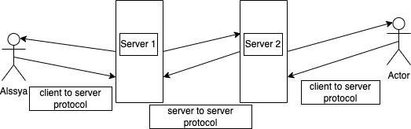

# Building an ActivityPub Library for Python Developers
## Introduction
ActivityPub is a protocol for social networking that is decentralized enabling the interchange of data between different social media systems. Thus, its aim of this library is to create the ActivityPub protocol in the form of Python language to the benefit of python programmers who wish to incorporate ActivityPub in their Apps. With that in mind, it is clear that ActivityPub would transform our online interactions for the better as it encourages users to leave the centralized, client-server model for more decentralized, federated networks. This library will appeal to developer of decentralized social networks, enthusiastic studying the federated protocols and all those who would like to develop social applications.

## Approach
To build a robust and reliable ActivityPub library, we will follow these steps:

1. **Model Definition**
- Define Python classes for ActivityPub entities (e.g., Actor, Object, Activity) using Pydantic for data validation and serialization.

**Example Model Definition**

```python
from pydantic import BaseModel, HttpUrl
   from typing import List, Optional

   class Actor(BaseModel):
       id: HttpUrl
       type: str
       name: str
       inbox: HttpUrl
       outbox: HttpUrl

   class Object(BaseModel):
       id: HttpUrl
       type: str
       attributedTo: Actor
       to: List[Actor] = []
       content: str

   class Activity(BaseModel):
       id: HttpUrl
       type: str
       actor: Actor
       object: Object
       to: List[Actor] = []
       context: Optional[str] = "https://www.w3.org/ns/activitystreams"

   actor = Actor(
       id="https://chatty.example/ben/",
       type="Person",
       name="Ben",
       inbox="https://chatty.example/ben/inbox",
       outbox="https://chatty.example/ben/outbox"
   )
   obj = Object(
       id="https://example.com/message",
       type="Note",
       attributedTo=actor,
       to=[actor],
       content="Hello, World!"
   )
...
```

2. **Serialization and Deserialization**
- Implement methods to convert Pydantic models to and from JSON-LD format, which is used by ActivityStreams.
- Pydantic provides built-in methods for serialization and deserialization, simplifying the process.

```python
    from pydantic import BaseModel
    from typing import Any

    class JsonSerializer:
        def serialize(self, obj: BaseModel) -> str:
            return obj.json(indent=4)
        
        def deserialize(self, json_str: str, model: BaseModel) -> BaseModel:
            return model.parse_raw(json_str)

    serializer = JsonSerializer()

    # Serialize an activity
    serialized_activity = serializer.serialize(activity)

    # Deserialize back to an Activity object
    deserialized_activity = serializer.deserialize(serialized_activity, Activity)
```

3. **Server Endpoints**
- Design a client class for sending ActivityPub requests (e.g., `ActivityPubClient`).
- Implement server endpoints for receiving ActivityPub requests (e.g., `ActivityPubServer`).
- Use a library like `aiohttp` for HTTP client functionality.
**Example Server Endpoint**

```python
from aiohttp import web

   class ActivityPubServer:
       async def handle_inbox_request(self, request: web.Request) -> web.Response:
           # This method will parse the incoming JSON-LD,
           # validate the sender's signature, and route the activity to the appropriate handler.
           data = await request.json()
           activity = Activity.parse_obj(data)  # Validate and parse incoming data
           # Process the incoming activity...
           ...

       async def handle_outbox_request(self, request: web.Request) -> web.Response:
           # This method will parse the outgoing activity and prepare it for delivery.
           data = await request.json()
           activity = Activity.parse_obj(data)  # Validate and parse incoming data
           # Prepare and send the outgoing activity...
        ...

app = web.Application()
app.add_routes([web.post("/inbox", ActivityPubServer().handle_inbox_request)])
app.add_routes([web.post("/outbox", ActivityPubServer().handle_outbox_request)])
web.run_app(app)

```

4. **Activity Handling**
    - Implement activity handling logic, including:
        - Activity creation and validation.
        - Activity forwarding and delivery.
        - Activity processing and updating.

    **Example Activity Handling**

    ```python
    class ActivityHandler:
        def create_activity(self, actor: Actor, object: Object) -> Activity:
            # Logic to create an activity
            return Activity(id="some_id", type="Create", actor=actor, object=object, to=[actor])

        def forward_activity(self, activity: Activity) -> None:
            # Logic to forward an activity
            ...

        def process_activity(self, activity: Activity) -> None:
            # Logic to process an activity
            ...


    class CreateActivityHandler(ActivityHandler):
        def process_activity(self, activity: Activity) -> None:
            # Logic specific to processing create activities
            ...

    class FollowActivityHandler(ActivityHandler):
        def process_activity(self, activity: Activity) -> None:
            # Logic specific to processing follow activities
            ...

    class LikeActivityHandler(ActivityHandler):
        def process_activity(self, activity: Activity) -> None:
            # Logic specific to processing like activities
            ...
    # Handlers would be selected dynamically based on activity type.
    ```

**Example Use Cases**
- Sending a message from one actor to another
- Creating a new activity and forwarding it to other actors
- Processing incoming activities and updating the local state

**Library Structure**
The library will be structured as follows:

```
pyfed/
│
├── __init__.py
│
├── models/             # Contains data models for ActivityPub entities
│   ├── __init__.py
│   ├── actor.py
│   ├── object.py
│   └── activity.py
│
├── serializers/        # Handles serialization and deserialization of models
│   ├── __init__.py
│   ├── json_serializer.py
│   ├── client.py
│   └── server.py
│
├── utils.py            # Common utility functions and validation helpers
│
├── security/           # Implement security features like HTTP signatures
│   ├── __init__.py
│   └── http_signatures.py
│
├── tests/              # Test cases for models, serializers, client, and server
│   ├── __init__.py
│   ├── test_models.py
│   ├── test_serializers.py
│   ├── test_client.py
│   └── test_server.py
│
├── CONTRIBUTING.md
└── README.md
```

## Installation and Usage Instructions
To install the library, run 

```bash
pip install pyfed
```

**Basic Usage Example**
Here’s a simple example of how to instantiate the server, create an actor and an object, and invoke an endpoint:

```python
from activitypub import ActivityPubServer, Actor, Object

# Initialize server
server = ActivityPubServer()

# Create an actor and an object
actor = Actor(
    id="https://chatty.example/ben/",
    type="Person",
    name="Ben",
    inbox="https://chatty.example/ben/inbox",
    outbox="https://chatty.example/ben/outbox"
)
obj = Object(
    id="https://example.com/message",
    type="Note",
    attributedTo=actor,
    to=[actor],
    content="Hello, World!"
)

# Create and serialize an activity
activity = server.create_activity(actor, obj)
serialized_activity = server.serialize(activity)

# (In a real scenario, you would send this serialized activity via a request)
```

## Contribution Guidelines
We welcome contributions to the library. Please see the `CONTRIBUTING.md` file for guidelines on how to contribute. You can report issues or request features on the [GitHub issues page](https://github.com/yourusername/pyfed/issues).

## Dependencies
The library depends on the following major dependencies:
- `aiohttp` (version >=3.7.4) for HTTP client functionality.
- `pydantic` (version >=1.8.0) for data validation and serialization.
- `pytest` (version >=6.0) for testing.

## Future Plans
We plan to implement additional features, including:
- Support for more ActivityPub endpoints (e.g., followers, following).
- Improved security and authentication mechanisms.
- Enhanced activity handling logic.
- Better error handling and debugging tools.

For a detailed roadmap of the project, see the `ROADMAP.md` file.

## Additional Resources
For more information on ActivityPub and its ecosystem, please see the following resources:

- [ActivityPub specification](https://www.w3.org/TR/activitypub/)
- [ActivityStreams standard](https://www.w3.org/TR/activitystreams-core/)
- [JSON-LD specification](https://www.w3.org/TR/json-ld/)

## License
This project is licensed under the MIT License. See the `LICENSE` file for details.

## Timeline
**Review of Library by October**
**Completion by December**

---

This is just a starting point, and the approach may evolve as we progress with the implementation. We welcome contributions and feedback from the community to help shape the library into a robust and reliable implementation of the ActivityPub protocol.

